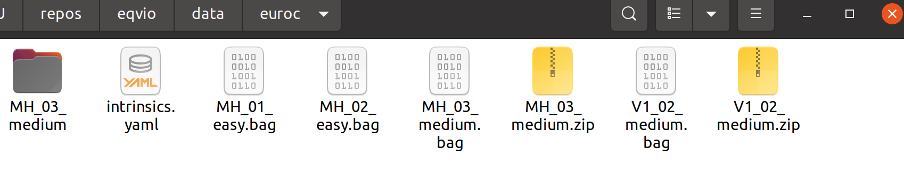

# EqVIO (Equivariant Visual Inertial Odometry)

This repository contains the implementation of EqVIO: An Equivariant Filter (EqF) for Visual Inertial Odometry (VIO).

Please see https://pvangoor.github.io/eqvio_docs/ for the documentation.

## Dependencies

- Eigen 3: `sudo apt install libeigen3-dev`
- Yaml-cpp: `sudo apt install libyaml-cpp-dev`
- GIFT: https://github.com/pvangoor/GIFT

### Optional Dependencis

- FreeGLUT (for visualisations): `sudo apt install freeglut3-dev`
- ROS (for reading ROS-Bags): http://wiki.ros.org/ROS/Installation
- Doxygen (for documentation): `sudo apt install doxygen`

### Build Guide (for ros users)

Modify the following settings in cmake if you want ROS compatibility.
You can use command-line cmake, use cmake-gui for convenience, or edit the CMakeLists.txt directly.

```
EQVIO_BUILD_TESTS ON
EQVIO_BUILD_VISUALISATION ON
EQVIO_BUILD_ROSBAG ON
EQVIO_SUPPORT_CONCEPTS OFF
EXTRA_WARNINGS ON
```

Then do the following commands from a terminal in the main directory to build EqVIO:

```
mkdir build
cd build
cmake ..  
cmake --build . -j8
```

### Running Guide

#### ASL Dataset Format

The file `intrinsics.yaml` is not needed as the required data is included in each sensor folder. Run EqVIO with:

```
./build/eqvio_opt  ~/data/MH_03_medium/ configs/EQVIO_config_EuRoC_stationary.yaml --display --mode asl
```

You will need to replace the dataset directory with a directory of your choice.


#### ROS bag

The `intrinsics.yaml` file is extracted from the sensors'.yaml files.
Since all of the sensors in the EuRoC dataset are identical, one intrinsics.yaml suits all.
If you plan to use a different dataset, you will need to change the intrinsics to match accordingly.
The example file is located in the root folder.
To use it, you should place the `intrinsics.yaml` file in the same folder as the ROSbags you wish to use:



Run EqVIO on ROSbags using:

```
./build/eqvio_opt  ./data/euroc/MH_03_medium.bag configs/EQVIO_config_EuRoC_stationary.yaml --display --mode ros

./build/eqvio_opt  ./data/euroc/V1_02_medium.bag configs/EQVIO_config_EuRoC_stationary.yaml --display --mode ros
```


And result can be seen in the output file.
  