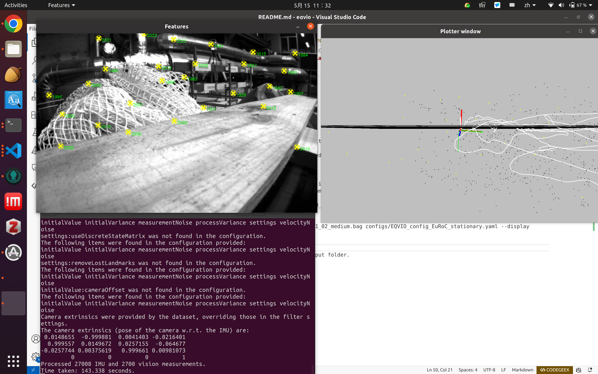

# EqVIO (Equivariant Visual Inertial Odometry)

This repository contains the implementation of EqVIO: An Equivariant Filter (EqF) for Visual Inertial Odometry (VIO).

Please see https://pvangoor.github.io/eqvio_docs/ for the documentation.

## Dependencies

- Eigen 3: `sudo apt install libeigen3-dev`
- Yaml-cpp: `sudo apt install libyaml-cpp-dev`
- GIFT: https://github.com/pvangoor/GIFT

### Optional Dependencis

- FreeGLUT (for visualisations): `sudo apt install freeglut3-dev`
- ROS (for reading ROS-Bags): http://wiki.ros.org/ROS/Installation
- Doxygen (for documentation): `sudo apt install doxygen`

### Build Guide (for ros users)
Modify `Options and settings` in CMakeLists.txt
```
option( EQVIO_BUILD_TESTS "Build Tests" ON)
option( EQVIO_BUILD_VISUALISATION "Build Visualisation Tool" ON)
option( EQVIO_BUILD_ROSBAG "Build EqVIO with rosbag reading enabled" ON)
option( EQVIO_SUPPORT_CONCEPTS "Build EqVIO using c++20 concepts" OFF)
option( EXTRA_WARNINGS "Enable extra warnings from gcc" ON)
```
And then run 
```
cmake ..  
cmake --build . -j8
```

### Running Guide

**ASL Dataset Format**

intrinsics.yaml is not needed as it is included in each sensor folder	
`
./build/eqvio_opt  ./data/MH_03_medium/ configs/EQVIO_config_EuRoC_stationary.yaml --display --mode asl
`
**ROS bag**

intrinsics.yaml is necessary, and it is extracted from the sensors' .yaml. For euroc dataset, the sensors are the same, so one intrinsics.yaml fits all.
```
./build/eqvio_opt  ./data/euroc/MH_03_medium.bag configs/EQVIO_config_EuRoC_stationary.yaml --display --mode ros

./build/eqvio_opt  ./data/euroc/V1_02_medium.bag configs/EQVIO_config_EuRoC_stationary.yaml --display --mode ros
```


And result can be seen in the output folder.
  